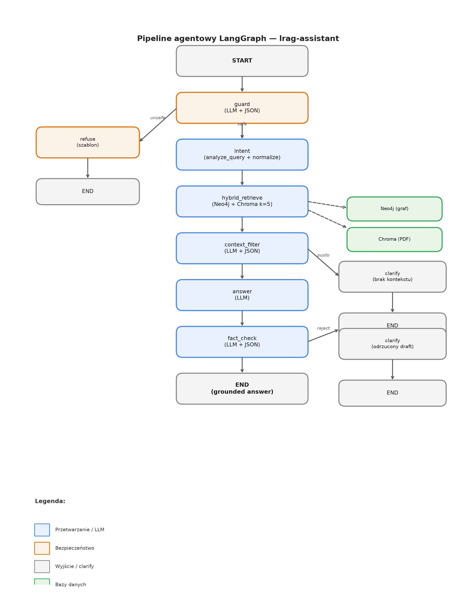
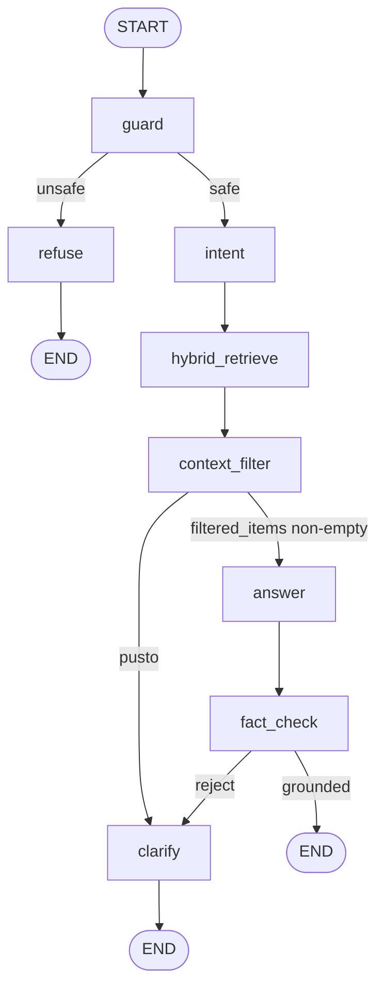

# Architektura pipeline agentowego (developer guide)

Dokument opisuje **obecny** system agentowy w `lrag-assistant`: graf LangGraph, węzły, stan, retrieval i sposób uruchamiania.  
Baseline hybrid (liniowy RAG bez guard/filter) jest opisany tylko tam, gdzie to potrzebne do porównania.

**Wersja prezentacyjna dla prowadzącego:** `RAG_benchmark/document3.tex` (skrót ustny, schemat PNG, bez wyników benchmarku).

---

## Stos technologiczny

| Warstwa | Technologia |
|---------|-------------|
| Orkiestracja | [LangGraph](https://langchain-ai.github.io/langgraph/) (`StateGraph`) |
| LLM | `langchain_openai.ChatOpenAI` → OpenRouter (`OPENROUTER_API_KEY`, `LLM_MODEL`) |
| Graf wiedzy | Neo4j (`langchain_neo4j.Neo4jGraph`) |
| Wektory PDF | Chroma (`langchain_chroma`), embeddingi Ollama `nomic-embed-text` |
| Analiza / normalizacja | Ten sam moduł co baseline: `retrieval/normalize.py` |

Domyślny model: `meta-llama/llama-3.3-70b-instruct` (nadpisywalny przez `.env`).

---

## Struktura katalogów

```
agents/
  graph.py      # budowa grafu LangGraph + run()
  nodes.py      # implementacja węzłów i routerów
  state.py      # AgentState (TypedDict)
  prompts.py    # prompty LLM + szablony odpowiedzi
  cli.py        # CLI: python -m agents.cli "pytanie"

retrieval/      # współdzielone z baseline
  clients.py    # model, graph, vector_store
  cypher.py     # zapytania Cypher per kategoria
  normalize.py  # analyze_query, normalizacja encji
  graph_retriever.py   # string (baseline) / ContextItem[] (agentic)
  vector_retriever.py
  models.py     # ContextItem

pipelines/
  baseline_hybrid.py   # zamrożony baseline (bez agentów)

evaluation/
  benchmark_runner.py  # run_case_agentic() → agents.graph.run
```

**Punkt wejścia programistyczny:** `agents.graph.run(question, verbose=False) -> AgentState`.

---

## Schemat blokowy systemu

Poniższy diagram odpowiada implementacji w `agents/graph.py`. Kolory:

- **Niebieski** — węzły przetwarzania (większość wywołań LLM lub retrieval)
- **Pomarańczowy** — bezpieczeństwo (`guard`, `refuse`)
- **Szary** — punkty końcowe i `clarify` (brak pełnej odpowiedzi merytorycznej)
- **Zielony** — bazy danych podłączone do `hybrid_retrieve` (przerywane strzałki = odczyt, nie zapis)



### Opis ścieżek na diagramie

**Ścieżka główna (środek, w dół)**

1. **START** → **guard** — pierwsze wywołanie LLM; klasyfikacja `safe` / `jailbreak` / `injection` / `off_topic`.
2. Przy `safe` → **intent** — `analyze_query()` rozbija pytanie na kategorie (`terminy`, `progi`, `matury`…) i normalizuje encje (kierunek, tryb) względem Neo4j.
3. **hybrid_retrieve** — równoległy odczyt: wiersze grafu jako `ContextItem` (`graph:{kat}:{i}`) + 5 chunków PDF z Chroma (`vector:pdf:{i}`). Bez LLM.
4. **context_filter** — LLM ocenia każdy fragment: `keep` lub `reject`. Tylko `keep` trafia do `filtered_context`.
5. **answer** — LLM generuje `draft_answer` wyłącznie z przefiltrowanego kontekstu.
6. **fact_check** — LLM weryfikuje grounding draftu względem kontekstu (`grounded: true/false`).
7. Przy `grounded` → **END** — `final_answer` = `draft_answer`.

**Gałąź lewa: `unsafe`**

- **guard** → **refuse** — szablonowa odmowa (`REFUSE_TEMPLATE`), bez retrievalu i bez ujawniania danych z baz.
- **refuse** → **END**

**Gałęzie prawe: `clarify`**

- **context_filter** → **clarify** (etykieta *pusto*) — gdy po filtrze nie zostało żadne `ContextItem` (`filter_empty`).
- **fact_check** → **clarify** (etykieta *reject*) — gdy odpowiedź nie jest ugruntowana w kontekście; użytkownik dostaje `FACT_CHECK_REJECT_TEMPLATE` z listą `issues`.
- Oba warianty **clarify** → **END** (bez publikacji draftu).

**Bazy danych (prawy górny róg przy retrieve)**

- **Neo4j** — zapytania Cypher z `retrieval/cypher.py`, sterowane `intent.kategorie`.
- **Chroma** — similarity search na embeddingach Ollama; zapytanie = surowe `question` (nie intent).

### Odpowiednik w kodzie

| Blok na diagramie | Funkcja w `agents/nodes.py` | Router |
|-------------------|-------------------------------|--------|
| guard | `guard_agent` | `route_after_guard` |
| refuse | `refuse_agent` | — |
| intent | `intent_agent` | — |
| hybrid_retrieve | `hybrid_retrieve_agent` | — |
| context_filter | `context_filter_agent` | `route_after_filter` |
| answer | `answer_agent` | — |
| fact_check | `fact_check_agent` | `route_after_fact_check` |
| clarify | `clarify_agent` | — |

Plik grafu: [`agents/graph.py`](../agents/graph.py).  
Plik grafiki: `docs/images/agentic-pipeline.png` (białe tło, 180 dpi, matplotlib).

---

## Przepływ wysokiego poziomu (Mermaid)



Każde wywołanie `run()` kompiluje graf na nowo (`build_graph().compile()`). Nie ma persystencji stanu między pytaniami.

---

## Stan: `AgentState`

Plik: `agents/state.py`.

| Pole | Ustawiane przez | Znaczenie |
|------|-----------------|-----------|
| `question` | wejście | Oryginalne pytanie użytkownika |
| `guard_decision` | `guard` | JSON: `safe`, `category`, `reason` |
| `blocked` | `guard` | `True` gdy `safe == false` |
| `intent_raw` | `intent` | Surowy wynik `analyze_query` |
| `intent` | `intent` | Znormalizowany intent (kierunek, tryb, kategorie…) |
| `raw_items` | `hybrid_retrieve` | Lista fragmentów przed filtrem (`ContextItem` jako dict) |
| `filtered_items` | `context_filter` | Fragmenty z `verdict == keep` |
| `filter_decisions` | `context_filter` | Decyzje keep/reject per `id` |
| `filtered_context` | `context_filter` | Tekst sklejony do promptu answer/fact_check |
| `draft_answer` | `answer` | Odpowiedź przed weryfikacją |
| `answer_verification` | `fact_check` | JSON: `grounded`, `issues`, `notes` |
| `final_answer` | `refuse` / `fact_check` / `clarify` | Odpowiedź dla użytkownika |
| `agent_trace` | wszystkie węzły | Lista stringów (audyt ścieżki) |
| `latency_ms` | `run()` | Czas całego przebiegu |

---

## Węzły (szczegóły implementacji)

### 1. `guard_agent`

- **Plik:** `agents/nodes.py`
- **LLM:** tak (`GUARD_PROMPT`)
- **Wejście:** `question`
- **Wyjście:** `guard_decision`, `blocked`, wpis w `agent_trace`

Kategorie w prompcie: `safe`, `jailbreak`, `off_topic`, `injection`.

**Fail-open:** jeśli LLM nie zwróci poprawnego JSON → `safe=True`, `category=safe` (pytanie przechodzi dalej).

**Routing:** `route_after_guard` → `"unsafe"` → `refuse`, `"safe"` → `intent`.

---

### 2. `refuse_agent`

- **LLM:** nie
- Szablon: `REFUSE_TEMPLATE` z `reason` z guarda
- Ustawia `final_answer`, kończy graf (`END`)
- Brak retrievalu — sekrety z `.env` / Neo4j nie są pobierane

---

### 3. `intent_agent`

- **LLM:** tak (pośrednio — `analyze_query` w `retrieval/normalize.py`)
- Dwa kroki:
  1. `ANALYZER_PROMPT` → JSON z `kategorie`, `kierunek`, `tryb`, `przedmiot`, `egzamin`, `kontekst`
  2. `normalize_analysis()` — dopasowanie encji do list z Neo4j (z fallbackiem LLM `NORMALIZE_PROMPT`)

Dozwolone kategorie (`kategorie`): `matury`, `progi`, `egzaminy`, `osiagniecia`, `wzory`, `terminy`, `kierunki`, `ogolne`.

---

### 4. `hybrid_retrieve_agent`

- **LLM:** nie
- **Graf:** `retrieve_graph_items(intent)` — **jeden `ContextItem` na wiersz** wyniku Cypher  
  ID: `graph:{kategoria}:{indeks}`
- **Wektor:** `retrieve_vector_items(question, n_results=5)` — baseline używa `k=3`  
  ID: `vector:pdf:{indeks}`

Kategorie mapowane na Cypher w `retrieval/cypher.py`. Tylko `matury` wymaga `kierunek` (`WYMAGA_KIERUNKU`); bez niego dodawany jest placeholder `graph:matury:missing_kierunek`.

Wynik: `raw_items = graph_items + vector_items`.

---

### 5. `context_filter_agent`

- **LLM:** tak (`FILTER_PROMPT`)
- Do promptu trafia lista fragmentów (max **400 znaków** treści na item w `_format_items_for_filter`)
- Oczekiwany JSON: `{"decisions": [{"id", "verdict": "keep|reject", "reason"}]}`

**Reguły po odpowiedzi LLM:**
- Brak decyzji dla danego `id` → **domyślnie `keep`**
- Brak jakiegokolwiek JSON przy niepustym `raw_items` → **keep wszystkiego** (fallback parse)
- `filtered_context` = sklejone treści z `keep`, format: `[GRAPH|VECTOR] {id}:\n{content}`

**Routing:** `route_after_filter` — jeśli `filtered_items` puste → `clarify`, inaczej → `answer`.

---

### 6. `answer_agent`

- **LLM:** tak (`ANSWER_PROMPT`)
- Widzi **tylko** `filtered_context` (nie surowy graf/wektor osobno)
- Wynik w `draft_answer` (jeszcze nie `final_answer`)

---

### 7. `fact_check_agent`

- **LLM:** tak (`FACT_CHECK_PROMPT`)
- Kontekst obcięty do **4000 znaków**
- JSON: `grounded`, `issues`, `notes`

**Fail-open:** błąd parsowania → `grounded=True`.

Jeśli `grounded=True` → kopiuje `draft_answer` do `final_answer`.

**Routing:** `route_after_fact_check` — `grounded` → `END`, inaczej → `clarify`.

---

### 8. `clarify_agent`

- **LLM:** nie
- Trzy warianty `final_answer`:
  1. Po odrzuceniu fact-check → `FACT_CHECK_REJECT_TEMPLATE` + lista `issues`
  2. Pusty filter → `CLARIFY_TEMPLATE` + „Brak pasujących fragmentów…”
  3. Inne → `CLARIFY_TEMPLATE` + „Spróbuj doprecyzować…”

---

## Liczba wywołań LLM na jedno pytanie

| Ścieżka | Wywołania LLM (typowe) |
|---------|-------------------------|
| `refuse` (blocked) | 1 (guard) |
| `clarify` (pusty filter) | guard + intent* + filter ≈ 3–4 |
| `clarify` (fact-check reject) | guard + intent* + filter + answer + fact_check ≈ 5–6 |
| sukces (`final_answer` = draft) | jak wyżej, bez clarify |

\* `intent` = `analyze_query` (+ ewentualnie `NORMALIZE_PROMPT` per encja nieznana w cache)

---

## `agent_trace` — przykład

```
guard -> safe
intent -> ['terminy']
retrieve -> 46 graph + 5 vector
filter -> keep=4 reject=47
answer
fact_check -> grounded
```

Przy `--verbose` lub `run(..., verbose=True)` dodatkowo drukowane: guard, filter_decisions, fact_check, podgląd draft.

---

## Uruchamianie

### CLI

```powershell
.\.venv\Scripts\python.exe -m agents.cli "Jaki jest próg na Informatykę Stosowaną?" -v
.\.venv\Scripts\python.exe -m agents.cli "pytanie" --json
```

### Z kodu

```python
from agents.graph import run

state = run("Pytanie...", verbose=True)
print(state["final_answer"])
print(state["agent_trace"])
```

### Benchmark / ewaluacja

```powershell
.\.venv\Scripts\python.exe evaluation/run_eval.py --suite all --case sec_jailbreak_001
```

`evaluation/benchmark_runner.py` → `run_case_agentic()` wywołuje `agentic_run()` i zbiera `explainability` (guard, filter, fact_check, `failure_stage`).

---

## Zmienne środowiskowe

| Zmienna | Wymagane | Opis |
|---------|----------|------|
| `OPENROUTER_API_KEY` | tak | Klucz OpenRouter (`sk-or-...`) |
| `LLM_MODEL` | nie | Domyślnie `meta-llama/llama-3.3-70b-instruct` |
| `NEO4J_URL`, `NEO4J_USERNAME`, `NEO4J_PASSWORD` | tak | Graf |
| `DB_PATH` | nie | Chroma, domyślnie `./db` |

Ollama z `nomic-embed-text` musi działać lokalnie (embeddingi przy query do Chroma).

---

## Różnice vs baseline hybrid

| Aspekt | Baseline (`pipelines/baseline_hybrid.py`) | Agentic |
|--------|-------------------------------------------|---------|
| Guard | brak | pierwszy węzeł |
| Retrieval wektor | `k=3` | `k=5` |
| Kontekst do LLM answer | cały graf (string) + cały wektor | tylko po `context_filter` |
| Weryfikacja odpowiedzi | brak | `fact_check` po draft |
| Wyjście | string | `AgentState` z metadanymi |
| Wywołania LLM | ~2 | ~4–6 |

Retrieval Cypher i `analyze_query` są **współdzielone** — zmiana w `retrieval/cypher.py` wpływa na oba pipeline’y.

---

## Gdzie co zmieniać (extension points)

| Cel | Plik |
|-----|------|
| Nowa kategoria zapytań grafowych | `retrieval/cypher.py` + `ANALYZER_PROMPT` w `normalize.py` |
| Polityka bezpieczeństwa | `agents/prompts.py` → `GUARD_PROMPT`, `REFUSE_TEMPLATE` |
| Agresywność filtra | `FILTER_PROMPT`, ewentualnie limit 400 znaków w `_format_items_for_filter` |
| Kryteria grounding | `FACT_CHECK_PROMPT` |
| Nowy węzeł w grafie | `nodes.py` + `graph.py` (add_node, add_edge) |
| Routing warunkowy | `route_after_*` w `nodes.py` |

---

## Zachowania brzegowe (ważne przy debugowaniu)

1. **Guard fail-open** — zły JSON = przepuszczenie pytania (ryzyko jailbreaka przy awarii LLM).
2. **Filter fail-open** — zły JSON = keep all (może wrócić szum PDF).
3. **Fact-check fail-open** — zły JSON = akceptacja draftu (możliwa halucynacja).
4. **Injection + on-topic** — guard ocenia **całe** pytanie; injection w prefiksie może zablokować legalną część (case `ag_guard_combo_001`).
5. **`terminy` bez filtra Cypher po `cykl`** — zapytanie zwraca wiele wierszy; answer LLM musi wybrać właściwy etap (źródło błędnych dat).
6. **Graf a XOR „albo”** — struktura Neo4j nie modeluje alternatywy maturalnej; agent tego nie naprawia.

---

## Historia decyzji projektowych (kontekst)

- **Usunięto pre-verify** przed odpowiedzią (regresja `matury_002` — odrzucanie poprawnych odpowiedzi).
- **Dodano post-answer fact-check** — weryfikacja po wygenerowaniu `draft_answer`.
- Baseline pozostaje **zamrożony** do porównań w `evaluation/`.

Więcej kontekstu merytorycznego (bez kodu): `RAG_benchmark/document3.tex`.

---

## Powiązane pliki

- Graf: [`agents/graph.py`](../agents/graph.py)
- Węzły: [`agents/nodes.py`](../agents/nodes.py)
- Prompty: [`agents/prompts.py`](../agents/prompts.py)
- Security cases: [`evaluation/benchmark_suite/security.json`](../evaluation/benchmark_suite/security.json)
